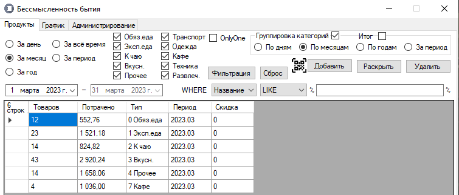
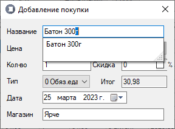
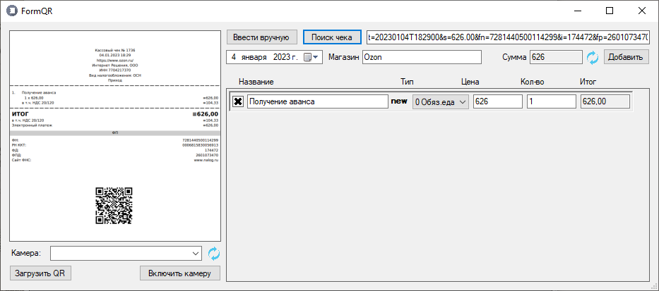
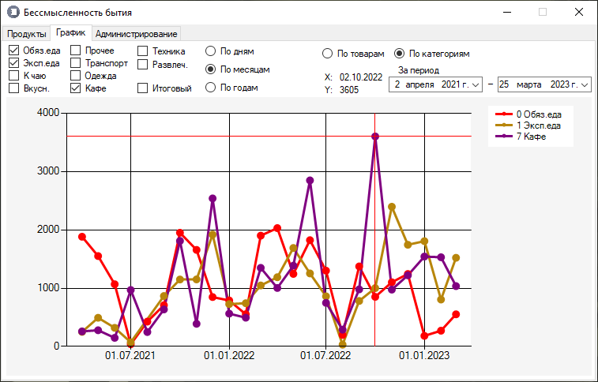

# Бессмысленность бытия

"Бессмысленность бытия" - это личный проект для записи и анализа собственных расходов. Основная часть связана с хранением информации в базе данных и сборе по анализу QR-коду чека. Каждый товар отображается в отдельной строке и может быть добавлен, отредактирован или удалён.
  
База данных храниться локально вместе с приложением, но может быть экспортирована (а также импортирована) в Excel файл. В качестве СУБД используется SQLite.
  

## Скриншоты программы

### Группировка по категориям

Внутри программы возможно выбрать фильтрацию или группировку как по категории, так и по времени. Выделенную строку группы возможно раскрыть, получив настройку фильтров по товарам соответствующей группы.

### Добавление нового товара

Каждый товар может быть добавлен вручную, если заполнить название, цену, количество, дату и название магазина. Если товар с введённым названием уже появлялся, то будет предложено автоматически заполнить всю остальную информацию по товару.

### Считывание QR-кода

Считывание по QR-коду может проводиться как с изображения (отдельного файла или буфера обмена), так и с видеокамеры. Если QR-код не считывается из-за серьёзных деформаций, то возможно ввести данные с самого чека (ФН, ФД, ФП, дата, время, сумма), чтобы найти электронный чек и собрать информацию по оплаченным товарам.

### Постройка графиков

  
По выбранным товарам и категориям возможно построить график и проследить изменение цены или ушедшие (-.-) деньги в каждой категории по дням, месяцам или годам, если статистика ведётся настолько долго.

## Разработчик:

- [EggOrNo](https://github.com/EggOrNo)
